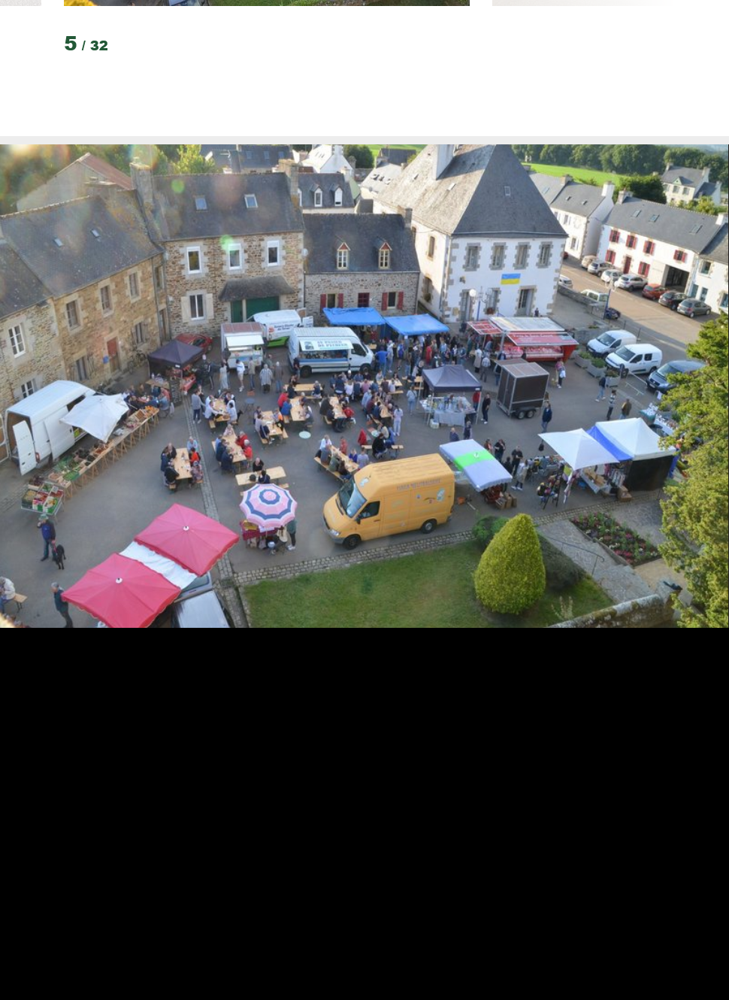
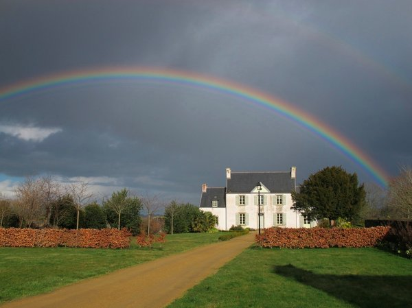

## Localisation

<a href="https://www.plouegat-guerrand.bzh/" target="_blank">Plouégat-Guerrand</a> est une commune du nord-est du Finistère, limitrophe des Côtes-d'Armor. Elle fait partie de la communauté d'agglomération de Morlaix Communauté.

Située à 20 minutes de Morlaix, et 25 minutes de Lannion, elle est également à 1h de Brest et 1h de St Brieuc via la RN12, facilement accessible à 6 km.

À 10 minutes se trouve la petite station balnéaire de Locquirec avec ses nombreuses plages, activités nautiques, port de plaisance, bars et restaurants.

<iframe width="425" height="350" frameborder="0" scrolling="no" marginheight="0" marginwidth="0" src="https://www.openstreetmap.org/export/embed.html?bbox=-3.791313171386719%2C48.5686563079607%2C-3.6059188842773438%2C48.671919512374565&amp;layer=mapnik&amp;marker=48.620314316501755%2C-3.6986160278320312" style="border: 1px solid black"></iframe> <small><a href="https://www.openstreetmap.org/?mlat=48.6203&amp;mlon=-3.6986#map=13/48.6203/-3.6986">Afficher une carte plus grande</a></small>

*Locquirec*

## Présentation

Plouégat-Guerrand est une commune dynamique de 1058 habitants.

### Commerces et Services

- Une boulangerie
- Un restaurant
- Un salon de coiffure
- Un bar-café
- Une épicerie prévue en 2024
- Un marché hebdomadaire d'avril à octobre le jeudi de 16h à 19h ainsi qu'un marché de Noël les 2 derniers jeudis de décembre
- Une bibliothèque avec jardin partagé
- Une école publique de la maternelle au CM2
- Ramassage scolaire pour le collège de Lanmeur et les lycées de Morlaix

#### Vente directe du producteur au consommateur :

- Vente à la ferme de crème glacée, yaourts, beurre, lait cru, viande
- Vente de fruits et légumes et confitures
- Vente à la ferme de viandes, charcuterie et plats préparés

*Le bourg de Plouégat-Guerrand*

_Église_01.jpg]
*L'église*

### Vie associative

- Trois comités des fêtes organisant chacun un pardon durant l'été
- Générations loisirs (cours de couture, art floral, bricolage, chorale, cours de gym, zumba, danse bretonne)
- Poney-club
- Club des anciens
- Club de football
- Club de pétanque
- Maison des artistes (céramiste, tissage et gravure, théâtre de papier)

*Maison des artistes*

## Pour plus d'informations

- [www.plouegat-guerrand.bzh](https://www.plouegat-guerrand.bzh)
- [www.baiedemorlaix.bzh/fr](https://www.baiedemorlaix.bzh/fr)
- [https://www.bretagne-cotedegranitrose.com](https://www.bretagne-cotedegranitrose.com)