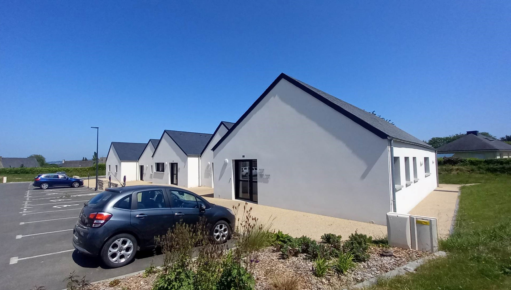

Située à 300m du bourg, la maison médicale a été achevée en 2021. Un seul médecin y exerce pour le moment, mais les locaux ont été prévus de sorte à pouvoir y aménager 2 bureaux médicaux si besoin.

## Professionnels actuels

- Un médecin généraliste avec secrétaire médicale à temps plein
- Un cabinet de quatre infirmiers
- Deux orthophonistes
- Deux kinésithérapeutes
- Deux ostéopathes
- Trois ergothérapeutes
- "La bulle": deux infirmières puéricultrices et accompagnantes en parentalité et une diététicienne pédiatrique
- Une animatrice et formatrice de signes associés à la parole

Sur la commune en collaboration avec le pôle de santé : une psychologue, une sophrologue et un naturopathe.

## Description de l'activité

Patientèle de 2500 personnes de tous profils, permettant une activité variée et personnalisable en fonction de vos envies.
Visites à domicile possibles.
Activité dans les maisons de retraites, les foyers logement et hôpital local de Lanmeur, Plouigneau et Plestin-les-Grèves.

.jpg)
*Secrétariat*

.jpg)
*Bureau médical*

.jpg)
*Salle d'attente*

*Extérieur*