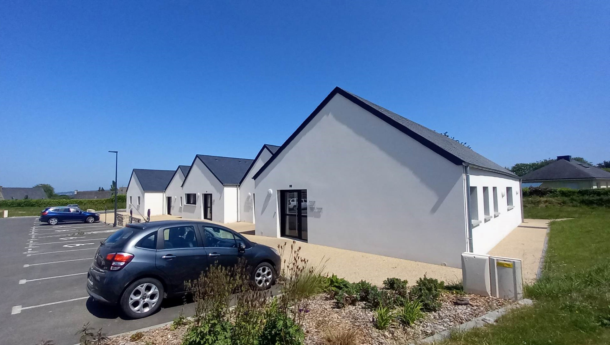

Située à 300m du bourg, la Maison Médicale a été achevée en 2021. Un seul médecin y exerce pour le moment, mais les locaux ont été prévus de sorte à pouvoir y aménager 2 cabinets médicaux si besoin.

## Professionnels actuels

– 1 médecin généraliste avec secrétaire médicale
– 1 cabinet de 4 infirmiers
– 2 orthophonistes
– 2 kinésithérapeutes
– 2 ostéopathes
– 3 ergothérapeutes
– 2 infirmières puéricultrices et accompagnantes en parentalité (sommeil, alimentation, bain bébé, yoga bébé et enfants, massage bébé...), 1 diététicienne  pédiatrique, « La bulle » 
– 1 animatrice et formatrice de signes associés à la parole
– et sur la commune en collaboration avec le pôle de santé : une psychologue, une
sophrologue et un naturopathe

## Description de l'activité

Patientèle de 2500 personnes de tous profils, permettant une activité variée et personnalisable en fonction de vos envies, visites à domicile possibles
activité dans les maisons retraites, les foyers logement et hôpital local sur les communes de Lamneur, Plouigneau et Plestin-les-Grèves.

.jpg)
(1).jpg)
.jpg)
.jpg)
